# Create the dataset

## Data Structure

|Attribute|Level|Description|
|-|-|-|
|**Settings**|Root|This is the object that contains all app settings.|
|**Trips**|Root|This is an array object where each child represents a single trip.|

For more detailed instructions, follow the [Trip Syntax](trip-syntax.html).

> [!TIP]
> Download a pre-filled [JSON template file](https://github.com/plans-coding/immer-in-bewegung/raw/refs/heads/main/bewegung.json).

> [!NOTE]
> To obtain coordinates for a given position, you can use the [Coordinate Tool](https://go.bewegung.app/coordinate-tool.html) and easily copy and paste the coordinates into the Editor in the app.

## Visualisation

